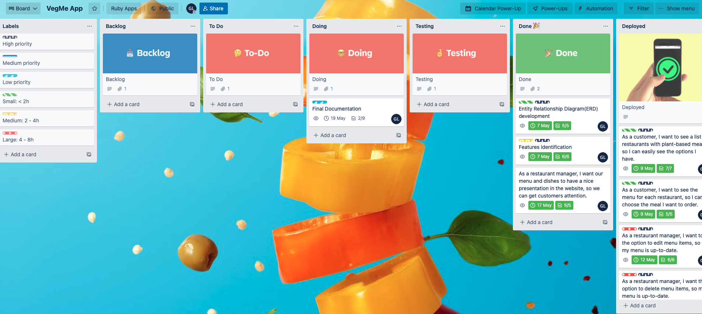
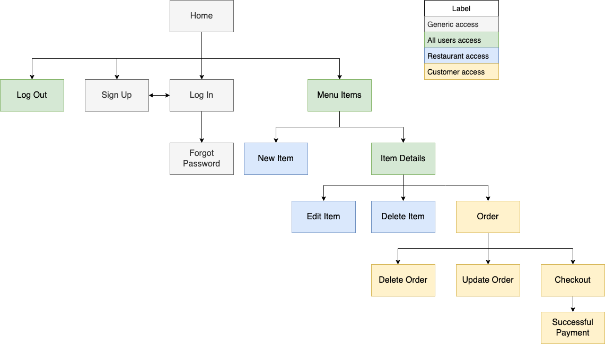
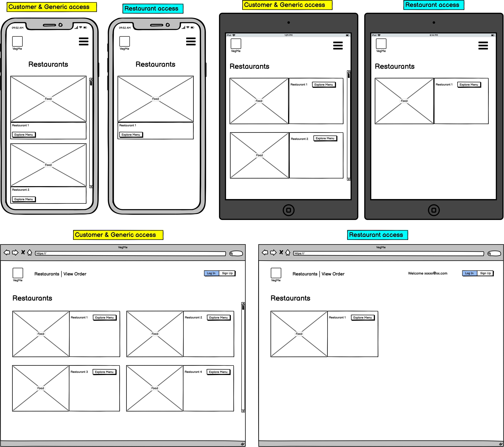
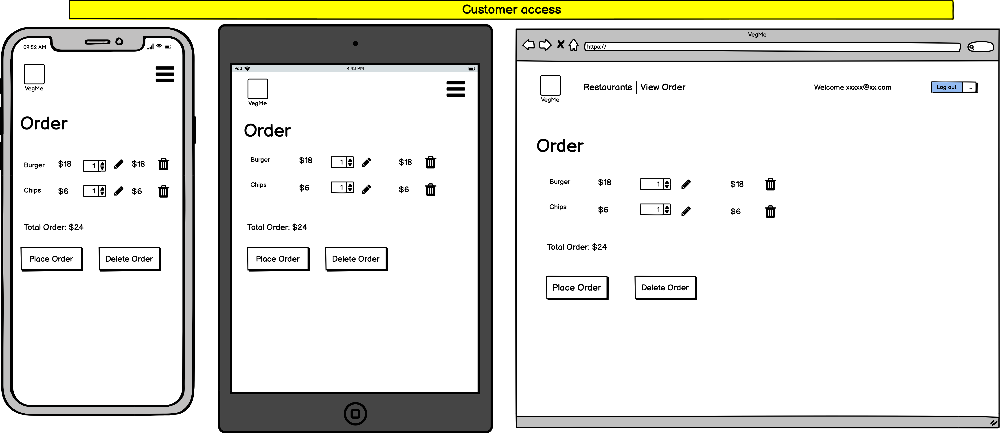
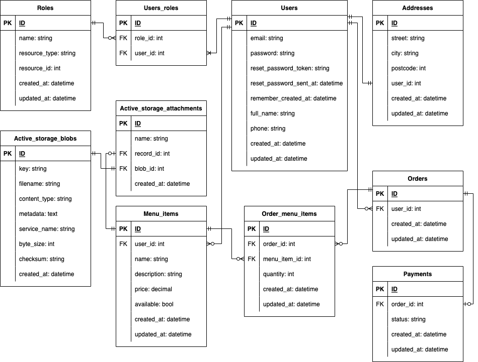

## VegMe 

### [Deployed App](https://vegme-app.herokuapp.com/)

### Problem identified
The current food delivery applications available in the market do not present vegan-friendly labelling for the meals sold in their platform. That brings lots of limitations for the public looking for food within that dietary requirement. In some instances, the food is not made exclusively with plant-based ingredients, but it is marked as vegan-friendly, in other cases the food is indeed vegan but not labelled at all, creating uncertainty. As consequence, consumers of plant-based food can spend unnecessary amount of time searching for a restaurant they feel comfortable ordering from, or even face frustration when their orders turnout to be different than they had expected.

### Related Opportunity
The problem mentioned above can be turned into an significant opportunity for restaurants to tap into the growing market of, not only vegan consumers, but all consumers opting to reduce meat or any animal product from their diet. 

> In Australia, 42% of people are eating less meat or none at all in 2019.  
> Among them, 10% identified themselves as vegan/vegetarian, 12% meat reducer and 20% flexitarian. (Hughes, 2022)

And the restaurant can do that by giving more visibility to their plant-based options to those potential customers and increase their revenue as a result. Which means that, by addressing the current problem, benefits can be presented not only to the customers but to the sellers too, in a win-win situation.

### Purpose
VegMe has the purpose to provide a two-sided marketplace platform, where restaurants can offer their self-delivery service on the plant-based meals from their menus, and customers can easily visualise a list of restaurants with vegan options available for delivery, while having the peace of mind that all food displayed in the app has been labelled accurately by the restaurant.  
It is worth mentioning that the platform is not dedicated to vegan restaurants, so any restaurant that has at least one pant-based meal to offer is more than welcomed to join.

### Target Audience
1. Customers interested in plant-based meals to be delivered at their door, willing to combine convenience and assurance that their order will satisfy their diet requirement, without unwanted surprises!
2. Restaurants with a self-delivery capability that already have plant-based options in their menu and want to make them more visible and accessible to the plant-based niche market, in order to broaden their customer base and revenue. 

### User Stories
1. As a customer, I want to see a list of restaurants with plant-based meals, so I can easily see the options I have.
2. As a customer, I want to see the menu for each restaurant, so I can choose the meal I want to order.
3. As a customer, I want to be able to add and edit items and quantities in the order, so I can modify order prior to checkout.
4. As a customer, I want to receive confirmation that my order has been processed and paid, so I know the restaurant received my order.
5. As a restaurant manager, I want to add new dishes, so all my current menu options are displayed.
6. As a restaurant manager, I want to edit items in the displayed menu, so my menu is up-to-date.
7. As a restaurant manager, I want to delete menu items, so my menu is up-to-date.
8. As a restaurant manager, I want to upload image to each dish, so it appeals to the customers.
9. As a restaurant manager, I want the app to provide a robust authentication process, so the restaurant's and our customer's data are protected.
10. As a restaurant manager, I want only authorised users to modify our menu, so our data is accurate.
11. As a restaurant manager, I want to upload image to each dish, so they appeal to the customers.
12. As a restaurant manager, I want our menu to have nice presentation in the website so we can get customers attention.

### Features
* User authentication using Devise
* User sign up with allocation of roles (restaurant or roles)
* Restricted access to pages and actions based on authorisation policy
* Features exclusive to Restaurant users:
  * Add items into their menu
  * Edit items
  * Delete items
  * Upload images (via cloud storage service)
* Features exclusive to Customer users:
  * Add items to order
  * Update quantity of items in the order
  * Remove items from the order
  * Delete order
  * Order payment (via Stripe and Webhook)
  * Payment confirmation

### Documentation

#### [GitHub Repo](https://github.com/limagisele/vegme.git)

#### [Kanban Board](https://trello.com/b/0oDVuJjG/vegme-app)  
  This project was managed and tracked using a Trello kanban board.  
  From the start it was defined which labels would be used to classify tasks by levels of priorities (based on the user stories) and estimated time required for completion, then different lists were created to represent different stages for each task/card.  
  Then, the last step prior to start working on the tasks was to establish the process of how the tasks would move from Backlog to Deployment phases. That process was defined with the following steps:
  1. Make User Stories and support tasks visible in the board by adding all tasks as cards to the **Backlog** list;
  2. Move the cards one-by-one to **To Do** as they becomes more fleshed out while giving preference to the highest priorities;
  3. Move card to **Doing** and assign owner name to the card;
  4. Once completed, card is moved to **Testing** for final tests to see how that feature is interacting with other ones;
  5. When tests are successful, move card to **Done** and celebrate that win!
  6. When deployment is achieved, move cards to **Deployed**, celebrate one more time!
  7. Now it's time to check the **Backlog** for the next task.

  Each card had a defined due date based on the initial assessment, however they were flexible as some unpredicted dependencies of cards could be identified later on. Additionally, each card had its own checklist of tasks containing all key tasks required to completed the card, to be used as a verification step prior to confirm the card is completed.

#### Sitemap
  
  

#### Wireframes  
  
  ##### Home Page
    

  ##### Sign Up, Log In & Forgot Password Pages

  

  ##### Menu Items Page

  

  ##### Item Details Page

  

  ##### New & Edit Item Pages  

  

  ##### Order Page

  

  ##### Payment Confirmation Page

  
  
#### ERD & Database Schema Design

  

#### Screenshots

### Tech Stack
* Languages: HTML, CSS, Ruby
* Frameworks: Rails, Bootstrap
* Deployment: Heroku
* Database: PostgreSQL
* Cloud storage: Cloudinary
* API: Stripe, Ultrahook
* Version control: Git, Github

### Third Party Services
* Cloudinary  
  
  Implemented to manage the image handling of the application in the cloud, covering processes of images upload, storage, transformation and optimisation when delivering them to the web browser.  
  Its image delivery is done using content delivery network (CDN), making the application faster and more reliable to the user.

* Stripe  
  
  In this app, Stripe is used to accept credit card payments from customers via Stripe Checkout page, which users are redirected to once they confirm their order. Stripe service allows the application to show a confirmation of payment to the user when it is successfully processed.  
  Another feature service used was the implementation of webhook between Stripe and the app to confirm if the payment was indeed successful and the `checkout.session.completed` event was received, by pushing real-time notifications with a HTTP response plus order and user metadata.  

* Ultrahook  
  
  In order to implement the webhook prior to deployment, Ultrahook was used to provide the endpoint URL required to set up webhook in Stripe and have the HTTP request sent to the localhost.

* Heroku  
  
  This Platform as a Service is used to deploy and run the application into production through continuous delivery in the cloud. As this PaaS is fully-managed it handles the servers, hardware and infrastructure required to get this application into market. 
  Heroku also provides a fully-managed data service supporting Postgres in the cloud with the Heroku Postgres add-on.

### High-Level Components (Abstractions)

For this project to take advantage of the MVC architecture, the following high-level resources are implemented:

* User  
  This component includes all registered users of the app and was generated with Devise, who generated the model and its controllers, views and routes. The views are used to render forms to the browser where users can perform actions such as sign up, log in and log out. Once the end-user request one of those pages in the browser the router sends it to the Users controller to render the appropriate view. After the form is filled and a post request reaches the router the the controller, who will perform the requested action. 
* Role  
  This entity is used to create roles for the User entity and the connection between those two is given by a join table users_role. This class does not require a controller as the action of allocating roles to users is done through the Rolify built-in methods. Additionally, there is no need to create views for this model either, as it does not need to present anything to the browser.
* Address  
  Class implemented with the only purpose of allowing some normalisation of the Users table, so its associated address fields are stored separately, removing the transitive dependencies from the Users table. As it is only serving the database, controller and views were not created for this entity.
* MenuItem  
  This resource includes a controller with all CRUD functionalities and view files related to the actions with get requests, such as index, new, edit, show and show_menu, where the end-user will be able to send post and hidden patch and delete requests back to the controller using forms.
* Order  
  This entity includes all orders created for the users and it has a many-to-many relationship with MenuItems entity, so a join table order_menu_items was created to allow a smoother interaction between Order and MenuItems. 
  The instances of Order generated here are session-based, being set once the user log in and access the menu page. For that reason, a controller was not implemented for this resource. Instead, the order creation is set in the order_menu_items and menu_items controller, the two pages where users can interact with their order. As consequence, there are no view files for this resource either.
* OrderMenuItem  
  This resource has a controller with all CRUD functions, working like a shopping cart, allowing users to see the items in their order plus add, update and delete the items or even delete the entire order. All of that is possible via the view files that allow the user to send the request to the controller to perform the actions.
* Payment  
  The Payment model stores the order_id and the successful status of the payment. Its controller was generated to provide a `success` action to render a view file to the user informing the payment was successful.

All the above controllers inherit from ApplicationController which inherits from ActionController, which is responsible for giving them access to the Rails standard methods.  
In the case of the models generated in this project, they all inherit from ApplicationRecord which inherits from ActiveRecord, and the latter uses ORM to allow us to store and manipulate data from objects without the need to write SQL statements as it does that in the background for the application. 

### Database Relations with ERD references
* Users & Addresses  
  One-to-one relation so both ends have cardinality of one and, in this for this project, both entities have the ordinality of one, so a user needs to have one and only one address and an address is linked to one and only one user.  
  In this relation, Addresses is the table with the foreign key, which is the `user_id`.
* Users & User_roles  
  One-to-many relation. Here a user_role record has one and only one user, while a user must have at least one role so it can have access to the application when logged in.  
  As result, the attribute `user_id` is added into the users_roles join table as the foreign key.
* User_roles & Roles  
  One-to-many relations, where a user_role instance has one and only one role but a role can be present in different user_roles, so this last relationship is represented in the ERD as optional and the first one as mandatory.  
  Again, the join table user_roles is the one carrying the foreign key, and in this relation it is the `role_id`.
* Users & Orders  
  One-to-many relationship, as a user can have orders or not, however an order to be created needs to be associated with one and only one user. From the ordinality perspective, is optional for the user to have an order but it is mandatory for the order to have a `user_id` as its foreign key, so it cannot be null.
* Users & Menu_items  
  One-to-many relation. A user may have many menu_items but a menu_item must have one and only one user. So menu_items is the entity with the foreign key, which is `user_id` and it has a mandatory relationship with Users. On the other hand, Users has a optional relation with Menu_items.
* Orders & Payments  
  One-to-one relationship, where a payment must be associated with one order, using `order_id` as its foreign key, and an order may have up to one payment. So both have one as their cardinality but payment has a mandatory relation with order and order has an optional one.
* Orders & Order_menu_items  
  One-to-many relation. An order can have many order_menu_items, but it is an optional relation, and an order_menu_item record must have one and only one order, so it is a mandatory relation. As Order_menu_items is a join table, it has the foreign key in this relation, which is `order_id`.
* Order_menu_items & Menu_items  
  One-to-many relation. A menu_item can have several order_menu_items and an order_menu_item record must have one and only one menu_item. As Order_menu_items is a join table, it has `menu_item_id` as the foreign key in this relation. Order_menu_item to menu_item is a mandatory relationship and the relation in the opposite direction has an optional ordinality.
* Menu_items & Active_storage_attachments  
  One-to-one relation. A menu_item in this project can have up to one attachment and an attachment must be associate with one and only one menu_item, so it is mandatory for it to have this link. However a menu_item can be created without an attachment, what is represented in the ERD as an optional relation. Menu_items are represented in the Active_storage_attachment table as a foreign key labelled `record_id`.
* Active_storage_attachments & Active_storage_blobs  
  One-to-one relationship. When an active_storage_attachment is created it is already connected to it associated active_storage_blob, so that is represented in the ERD as a mandatory relation on both sides and a blob can only be linked to one attachment and an attachment is only associated with one blob.

### Project Models and Active Record Associations
The bi-direction associations in this projects are listed below:

#### belongs_to and has_one relations:
* Address `belongs_to :user` & User `has_one :address`  
  This means that an instance of address must have at least one user, and that is why it carries `user_id` as its foreign key. Also, it means the user may have up to one address in the record and that is why the Address model is called in its singular form when declared.
* Payment `belongs_to :order` & Order `has_one :payment`  
  This relation is similar to the one above, as it is also a belongs_to and has_one relationship. So a payment needs to be linked to one and only one order and an order can have up to one payment in the database. 
  
#### belongs_to and has_many relations:
* Order `belongs_to :user` & User `has_many :orders`  
  Here the object order must be linked to a user with its related foreign key and an instance of User may have zero or multiple orders in the database, that being the reason the Order model is pluralized when declared inside the User model.

* MenuItem `belongs_to :user` & User `has_many :menu_items`  
  Similarly to the one just above. Menu_item must have one user and a user can have up to many menu_items.

#### belongs_to and has_many :through
* MenuItem `has_many :orders, through: :order_menu_items` & Order `has_many :menu_items, through: :order_menu_items`  
  As a menu_item can be added into many orders and an order can have multiple menu_items, they require to be linked through a third model, which in this case is the OrderMenuItems with its equivalent join table. So, only through the OrderMenuItems model, a menu_item object can have many orders and an instance of Order can have many menu_items.  
  As consequence, order_menu_item must be linked to at least one order and one menu_item and an order and a menu_item can both have up to several order_menu_items, as listed in the bullets below.
  * OrderMenuItem `belongs_to :order` & Order `has_many :order_menu_items`  
  * OrderMenuItem `belongs_to :menu_item` & MenuItem `has_many :order_menu_items`  
  
#### has_and_belongs_to_many relations:
* Role `has_and_belongs_to_many` & Users `has_many :roles`  
  This association is also for a many-to-many connection, however the main difference from it the `has_many :through` is that this one does not require a third model. The connection is done only by a join table, in this case the users_roles table. So a role can be allocated to many users and a user can have several roles and link made between them can be found in the associated join table.

### References

Hughes, C. (2022). *Australia: share of people avoiding or reducing meat consumption*. [online] Statista. Available at: https://www.statista.com/statistics/1232881/australia-share-of-people-avoiding-or-reducing-meat-consumption/#:~:text=Breakdown%20of%20people%20avoiding%20or%20reducing%20meat%20consumption%20in%20Australia%202019&text=In%20Australia%2C%2042%20percent%20of.